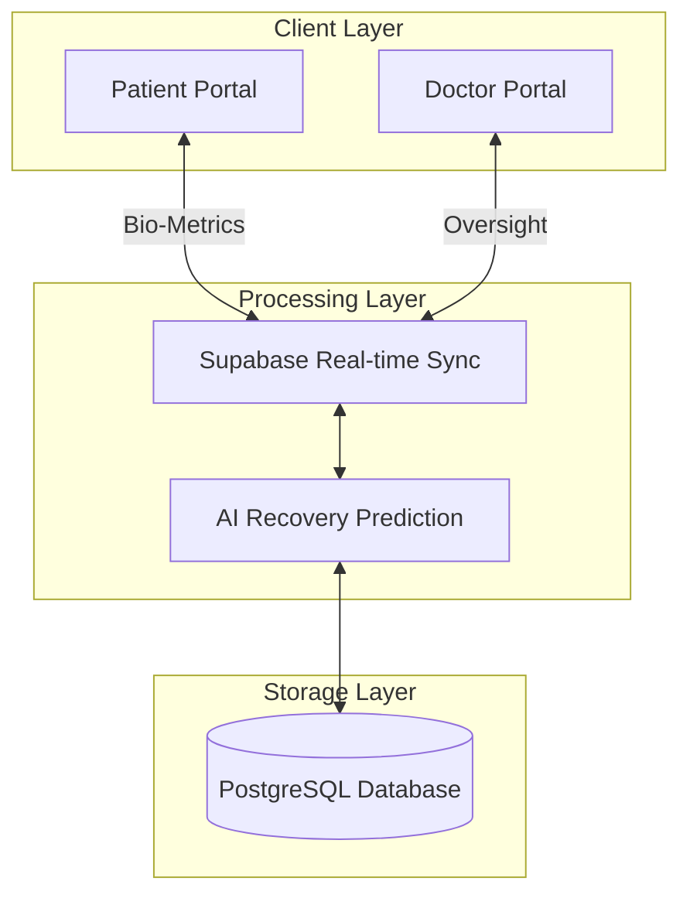
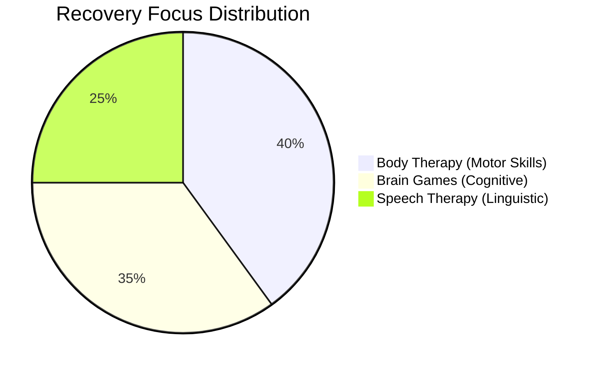
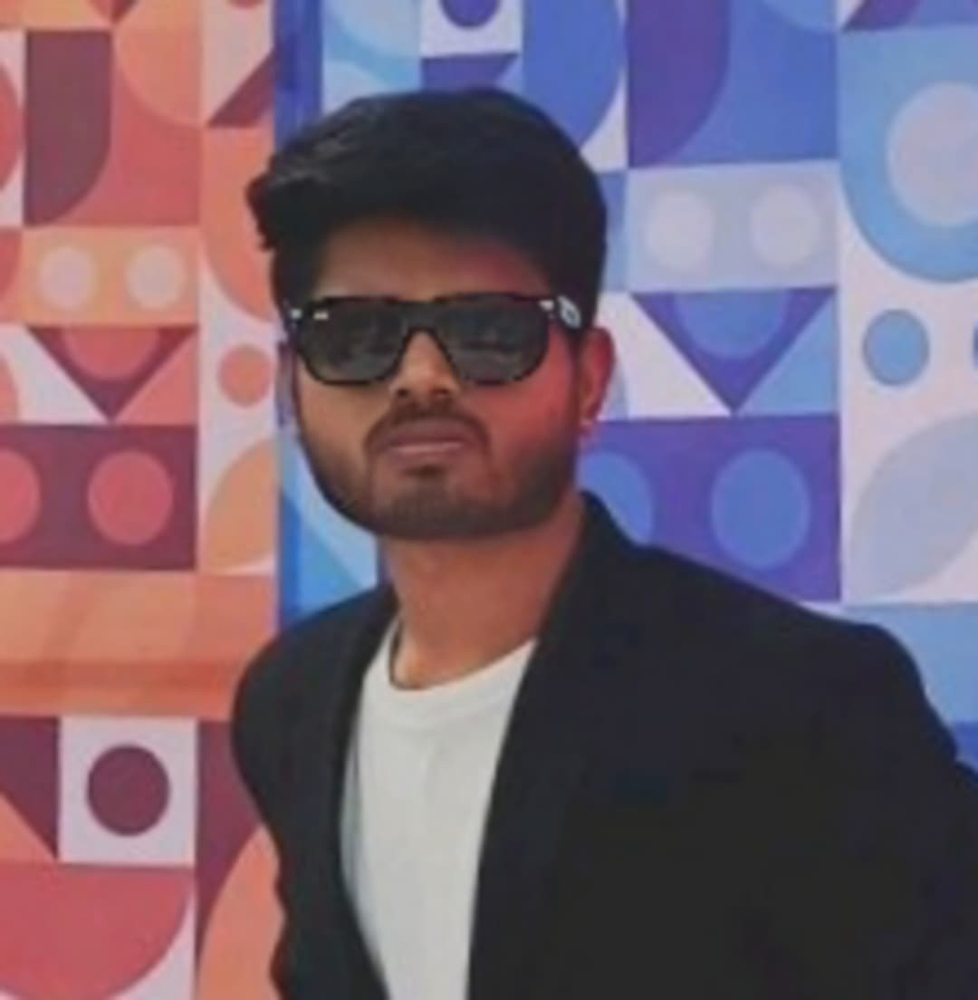
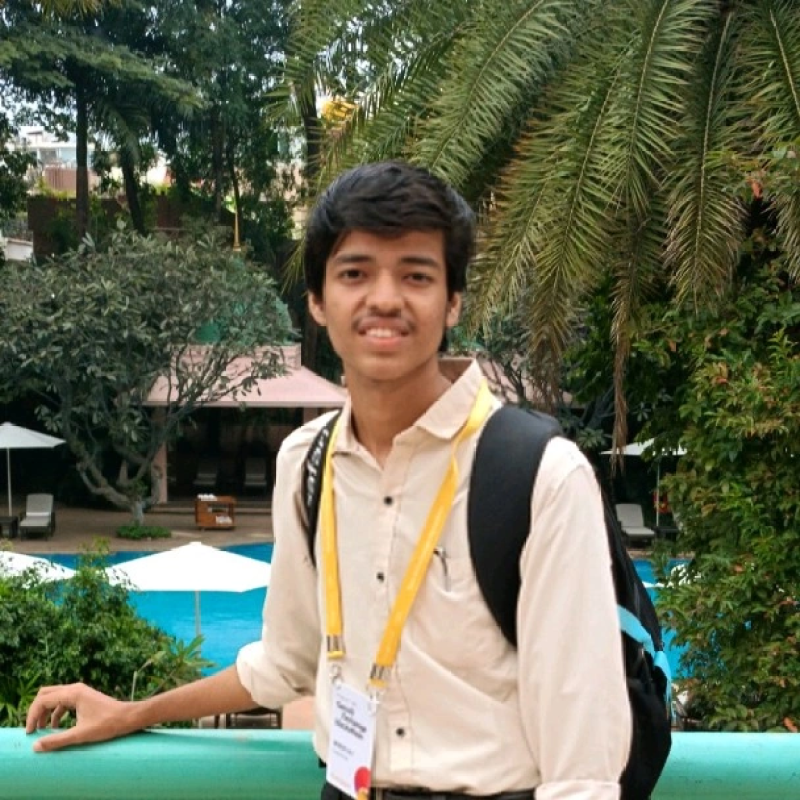

# 🧠 NeuroSense — Clinical Neuro-Recovery Protocol

<div align="center">
  
  
  <h3>Empowering Recovery through Bio-Telemetry & AI</h3>

  <p align="center">
    
    
  </p>

  <p align="center">
    
    
    
    
  </p>
</div>

---

## 🏆 Microsoft Imagine Cup 2026
This project is developed for **Microsoft Imagine Cup 2026**. NeuroSense is a clinical-grade AI platform built to revolutionize neurological rehabilitation by bridging the gap between clinical data and patient recovery through real-time bio-telemetry.

---

## 🏗 System Architecture
<div align="center">



</div>

---

## 🧬 Specialized Modules

### 1. Neuro-Pathways (Patient)
Interactive recovery protocols designed to stimulate neural plasticity.



### 2. Clinical Analytics (Doctor)
High-precision monitoring tools for medical professionals.

---

## 🛠 Tech Stack & Tools

<div align="center">

| Layer | Technologies |
| :--- | :--- |
| **Logic** |   |
| **Design** |   |
| **Backend** |   |
| **Viz** |   |

</div>

---

## 👥 Meet the Team

<div align="center">
  <table style="border-collapse: collapse; border: none;">
    <tr>
      <!-- Akshay Gurav -->
      <td align="center" style="padding: 20px; vertical-align: top;">
        <div style="background-color: #0d1117; border: 1px solid #30363d; border-radius: 12px; padding: 24px; width: 280px; min-height: 480px; box-shadow: 0 4px 6px -1px rgba(0, 0, 0, 0.1);">
          
          <h3 style="margin: 0; color: #f0f6fc;">Akshay Gurav</h3>
          <p style="color: #58a6ff; font-size: 0.9em; margin: 4px 0 16px 0; font-weight: 600;">Team Leader & Full-Stack Developer</p>
          <p style="color: #8b949e; font-size: 0.85em; line-height: 1.6; text-align: center;">
            Led the Team (Leadership) || Executed End-to-End Frontend and Backend Development || Deployed the Web Application || Oversaw Research, Team Coordination, and UI/UX Design || Produced the Project Demonstration Video.
          </p>
          <div style="margin-top: 20px;">
            <a href="https://www.linkedin.com/in/akshay---gurav/"></a>
          </div>
        </div>
      </td>
      <!-- Shreyash Kumar -->
      <td align="center" style="padding: 20px; vertical-align: top;">
        <div style="background-color: #0d1117; border: 1px solid #30363d; border-radius: 12px; padding: 24px; width: 280px; min-height: 480px; box-shadow: 0 4px 6px -1px rgba(0, 0, 0, 0.1);">
          
          <h3 style="margin: 0; color: #f0f6fc;">Shreyash Kumar</h3>
          <p style="color: #58a6ff; font-size: 0.9em; margin: 4px 0 16px 0; font-weight: 600;">Project Operations Lead</p>
          <p style="color: #8b949e; font-size: 0.85em; line-height: 1.6; text-align: center;">
            Idea Selection || Project Management || Visual Suggestions || Final Devofolio Submission || Info Compilation & Updates || Including basic works.
          </p>
          <div style="margin-top: 20px;">
            <a href="https://www.linkedin.com/in/shreyash-kumar-9774b622a/"></a>
          </div>
        </div>
      </td>
    </tr>
    <tr>
      <!-- Mudit Vij -->
      <td align="center" style="padding: 20px; vertical-align: top;">
        <div style="background-color: #0d1117; border: 1px solid #30363d; border-radius: 12px; padding: 24px; width: 280px; min-height: 400px; box-shadow: 0 4px 6px -1px rgba(0, 0, 0, 0.1);">
          
          <h3 style="margin: 0; color: #f0f6fc;">Mudit Vij</h3>
          <p style="color: #58a6ff; font-size: 0.9em; margin: 4px 0 16px 0; font-weight: 600;">Developer</p>
          <p style="color: #8b949e; font-size: 0.85em; line-height: 1.6; text-align: center;">
            [Description to be added]
          </p>
          <div style="margin-top: 20px;">
            <a href="https://www.linkedin.com/in/muditvij/"></a>
          </div>
        </div>
      </td>
      <!-- Shreyansh Jain -->
      <td align="center" style="padding: 20px; vertical-align: top;">
        <div style="background-color: #0d1117; border: 1px solid #30363d; border-radius: 12px; padding: 24px; width: 280px; min-height: 400px; box-shadow: 0 4px 6px -1px rgba(0, 0, 0, 0.1);">
          
          <h3 style="margin: 0; color: #f0f6fc;">Shreyansh Jain</h3>
          <p style="color: #58a6ff; font-size: 0.9em; margin: 4px 0 16px 0; font-weight: 600;">Developer</p>
          <p style="color: #8b949e; font-size: 0.85em; line-height: 1.6; text-align: center;">
            [Description to be added]
          </p>
          <div style="margin-top: 20px;">
            <a href="https://www.linkedin.com/in/shreyansh-jain-7511a232a/"></a>
          </div>
        </div>
      </td>
    </tr>
  </table>
</div>

---

## 🚀 Getting Started

### 1. Installation
```bash
git clone https://github.com/[Your-Username]/neurosense.git
cd neurosense
npm install
```

### 2. Environment Configuration
Create a `.env.local`:
```env
VITE_SUPABASE_URL=your_supabase_url
VITE_SUPABASE_ANON_KEY=your_supabase_anon_key
```

### 3. Launch
```bash
npm run dev
```

---

<div align="center">
  <sub>Built with ❤️ for <strong>Microsoft Imagine Cup 2026</strong></sub>
</div>
