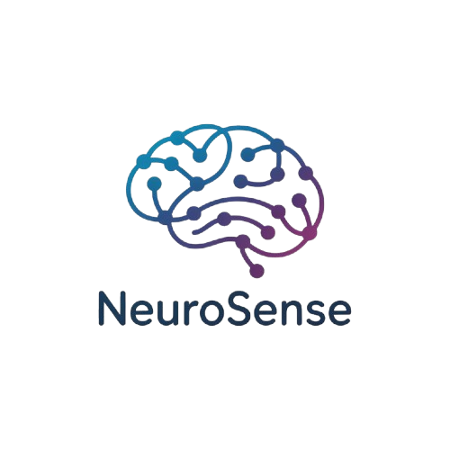
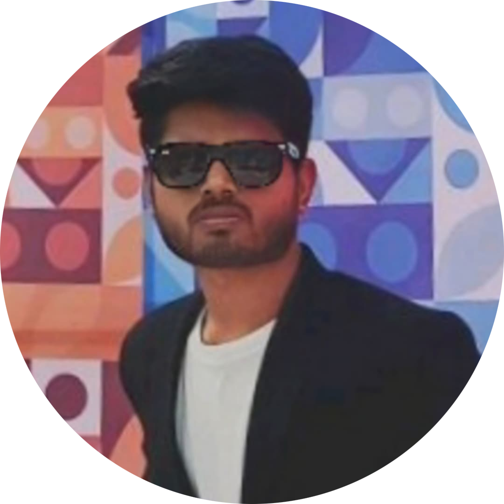
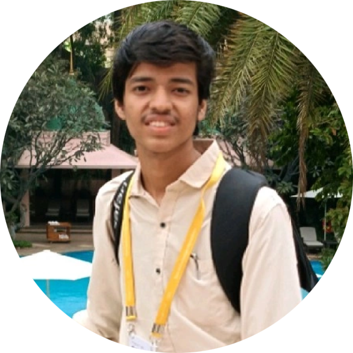
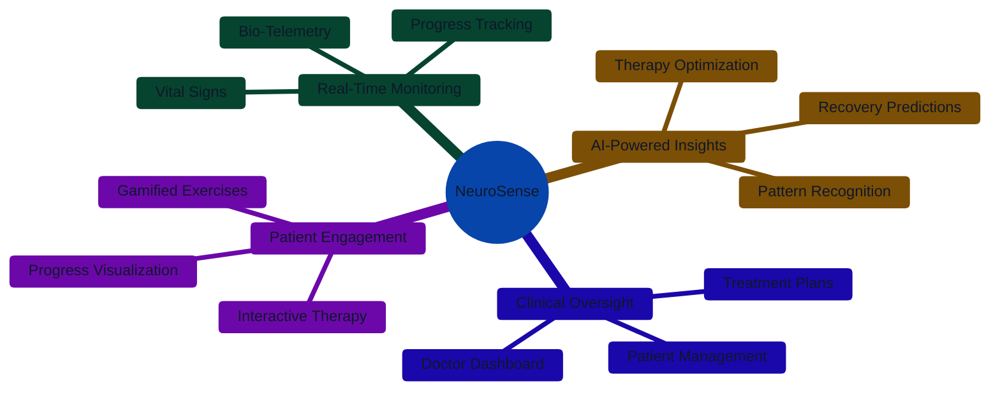

<div align="center">



# NeuroSense
### Clinical Neuro-Recovery Platform

<h3>AI-Powered Neurological Rehabilitation System</h3>

<p align="center">
  
  
</p>

<p align="center">
  
  
  
  
</p>

</div>

---

## 👥 Meet the Team

<div align="center">
  <table style="border-collapse: collapse; border: none;">
    <tr>
      <!-- Akshay Gurav -->
      <td align="center" style="padding: 20px; vertical-align: top;">
        <div style="background-color: #0d1117; border: 1px solid #30363d; border-radius: 12px; padding: 24px; width: 280px; min-height: 480px; box-shadow: 0 4px 6px -1px rgba(0, 0, 0, 0.1);">
          
          <h3 style="margin: 0; color: #f0f6fc;">Akshay Gurav</h3>
          <p style="color: #58a6ff; font-size: 0.9em; margin: 4px 0 16px 0; font-weight: 600;">Developer</p>
          <p style="color: #8b949e; font-size: 0.85em; line-height: 1.6; text-align: center;">
            Ex–Intern@Curetopia (USA) | Data Science & AI/ML | Power BI & Excel | NEC (IIT-Bombay) E-Cell Finalist'25 | Hackathons (Dev & Leader) | Web Dev & SQL | LLM's-RAG | Ex-VP @ E-Cell | CA @ IIT-B '24 & '25 | Open Source
          </p>
          <div style="margin-top: 20px;">
            <a href="https://www.linkedin.com/in/akshay---gurav/"></a>
          </div>
        </div>
      </td>
      <!-- Shreyash Kumar -->
      <td align="center" style="padding: 20px; vertical-align: top;">
        <div style="background-color: #0d1117; border: 1px solid #30363d; border-radius: 12px; padding: 24px; width: 280px; min-height: 480px; box-shadow: 0 4px 6px -1px rgba(0, 0, 0, 0.1);">
          
          <h3 style="margin: 0; color: #f0f6fc;">Shreyash Kumar</h3>
          <p style="color: #58a6ff; font-size: 0.9em; margin: 4px 0 16px 0; font-weight: 600;">Developer</p>
          <p style="color: #8b949e; font-size: 0.85em; line-height: 1.6; text-align: center;">
            AI Project Intern at @Infosys Springboard | CA @GSSoC'25 and @E-cell IIT Bombay | NIT Patna | DSA in C++ | Web designing at @Incubation Centre NIT Patna | Data Analyst at @NxtWave | AI/ML | Fellow at @NxtWave CCBP4.0
          </p>
          <div style="margin-top: 20px;">
            <a href="https://www.linkedin.com/in/shreyash-kumar-9774b622a/"></a>
          </div>
        </div>
      </td>
    </tr>
    <tr>
      <!-- Mudit Vij -->
      <td align="center" style="padding: 20px; vertical-align: top;">
        <div style="background-color: #0d1117; border: 1px solid #30363d; border-radius: 12px; padding: 24px; width: 280px; min-height: 400px; box-shadow: 0 4px 6px -1px rgba(0, 0, 0, 0.1);">
          
          <h3 style="margin: 0; color: #f0f6fc;">Mudit Vij</h3>
          <p style="color: #58a6ff; font-size: 0.9em; margin: 4px 0 16px 0; font-weight: 600;">Developer</p>
          <p style="color: #8b949e; font-size: 0.85em; line-height: 1.6; text-align: center;">
            Winner @Google Cloud GenAI Exchange Hackathon | B.Tech | Dayalbagh Educational Institute | Student Intern @VLabs | Training & Placement Cell Coordinator
          </p>
          <div style="margin-top: 20px;">
            <a href="https://www.linkedin.com/in/muditvij/"></a>
          </div>
        </div>
      </td>
      <!-- Shreyansh Jain -->
      <td align="center" style="padding: 20px; vertical-align: top;">
        <div style="background-color: #0d1117; border: 1px solid #30363d; border-radius: 12px; padding: 24px; width: 280px; min-height: 400px; box-shadow: 0 4px 6px -1px rgba(0, 0, 0, 0.1);">
          
          <h3 style="margin: 0; color: #f0f6fc;">Shreyansh Jain</h3>
          <p style="color: #58a6ff; font-size: 0.9em; margin: 4px 0 16px 0; font-weight: 600;">Developer</p>
          <p style="color: #8b949e; font-size: 0.85em; line-height: 1.6; text-align: center;">
            First Runners-Up @Refcold India Global Poster Design Competition 2025 | Intern@Virtual Labs | B.Tech | Dayalbagh Educational Institute | Training & Placement Cell @FOE DEI, Agra
          </p>
          <div style="margin-top: 20px;">
            <a href="https://www.linkedin.com/in/shreyansh-jain-7511a232a/"></a>
          </div>
        </div>
      </td>
    </tr>
  </table>
</div>

---

## 📍 Overview

**NeuroSense** is a clinical-grade AI platform developed for **Microsoft Imagine Cup 2026**. It revolutionizes neurological rehabilitation by integrating **bio-telemetry**, **AI-driven analytics**, and **doctor-supervised therapy** to support patients recovering from stroke, traumatic brain injury, and speech disorders.

<div align="center">

### 🎯 Core Mission


```mermaid
%%{init: {'theme':'base', 'themeVariables': { 
  'primaryColor':'#3b82f6',
  'primaryTextColor':'#0f172a',
  'primaryBorderColor':'#60a5fa',
  'lineColor':'#475569',
  'secondaryColor':'#10b981',
  'secondaryTextColor':'#ffffff',
  'tertiaryColor':'#f59e0b',
  'tertiaryTextColor':'#ffffff',
  'background':'#ffffff',
  'mainBkg':'#ffffff',
  'secondBkg':'#f1f5f9',
  'nodeTextColor':'#0f172a',
  'clusterBkg':'#e0f2fe',
  'clusterBorder':'#7dd3fc',
  'defaultLinkColor':'#475569',
  'titleColor':'#0f172a',
  'edgeLabelBackground':'#f8fafc'
}}}%%
mindmap
  root((NeuroSense))
    Real-Time Monitoring
      Bio-Telemetry
      Progress Tracking
      Vital Signs
    AI-Powered Insights
      Recovery Predictions
      Therapy Optimization
      Pattern Recognition
    Clinical Oversight
      Doctor Dashboard
      Treatment Plans
      Patient Management
    Patient Engagement
      Interactive Therapy
      Gamified Exercises
      Progress Visualization
```

</div>

---

## 🎯 Problem Statement

Neurological rehabilitation today suffers from:
- ❌ Lack of continuous monitoring between clinical visits
- ❌ One-size-fits-all therapy plans
- ❌ Limited doctor–patient interaction outside clinics

**NeuroSense solves this:**
- ✅ Real-time patient monitoring
- ✅ AI-assisted personalized therapy
- ✅ Doctor-controlled clinical oversight
- ✅ HIPAA-aligned secure data handling

---

## 🔒 Privacy, Security & Compliance

### 🔑 Data Protection
- **End-to-End Encryption** (in transit & at rest)
- **Secure Authentication** via Supabase Auth + Google OAuth
- **Environment-based secret management**

### 👨‍⚕️ Role-Based Access Control
- **Patient**: Access only own medical data
- **Doctor**: Access only assigned patients with verified credentials
- **Admin**: System management without medical data visibility

### 📜 Compliance
- HIPAA-aligned architecture
- Data minimization principles
- Explicit patient consent
- Audit logs for clinical actions

### 🤖 Ethical AI
- Transparent AI (no black-box decisions)
- AI provides **recommendations**, not diagnoses
- Final authority with certified doctors

---

## 🧩 System Modules

### 👤 Patient Portal
- **Body Therapy** - Motor recovery with 3D tracking
- **Brain Games** - Cognitive rehabilitation
- **Speech Therapy** - Linguistic recovery
- **Progress Dashboard** - Visual analytics
- **Doctor Connect** - Secure communication

### 👨‍⚕️ Doctor Portal
- **Patient Monitoring** - Real-time oversight
- **Therapy Analytics** - Performance metrics
- **AI Insights** - Recovery predictions
- **Treatment Plans** - Customized protocols
- **Clinical Chat** - Secure messaging

---

## 🛠️ Technology Stack

<div align="center">

| Layer          | Technologies                                                                 |
|----------------|------------------------------------------------------------------------------|
| **Frontend**   | React • TypeScript                                                           |
| **Styling**    | Tailwind CSS                                                                 |
| **Backend**    | Supabase • PostgreSQL                                                        |
| **Visualization** | Three.js • Recharts                                                       |
| **Auth**       | Google OAuth                                                                 |

</div>

---

## 🚀 Getting Started

### Prerequisites
- Node.js ≥ 18
- Supabase Account
- Google Cloud Console (for OAuth)

### Installation
```bash
git clone https://github.com/Akshay-gurav-31/NeuroSense.git
cd NeuroSense
npm install
```

### Environment Setup
Create `.env.local`:
```env
VITE_SUPABASE_URL=your_project_url
VITE_SUPABASE_ANON_KEY=your_anon_key
```

### Database Setup
1. Go to Supabase **SQL Editor**
2. Copy contents of `schema.sql`
3. Run in SQL Editor

### Launch
```bash
npm run dev
```
App available at `http://localhost:5173`

---

## 📈 Expected Impact
- 🚀 **25% faster** recovery cycles
- 🎮 **40% higher** patient engagement
- 🧠 **60% better** clinical insights
- ⭐ **85% patient** satisfaction

---

## 📞 Contact
**Email**: akshaygurav416115@gmail.com  
**GitHub**: [https://github.com/Akshay-gurav-31/NeuroSense](https://github.com/Akshay-gurav-31/NeuroSense)

---

## ⚠️ Disclaimer
> **NeuroSense is not a diagnostic tool.**  
> It is a **clinical support system** designed to assist licensed medical professionals.

<div align="center">
  <sub>Developed for Microsoft Imagine Cup 2026</sub>
</div>